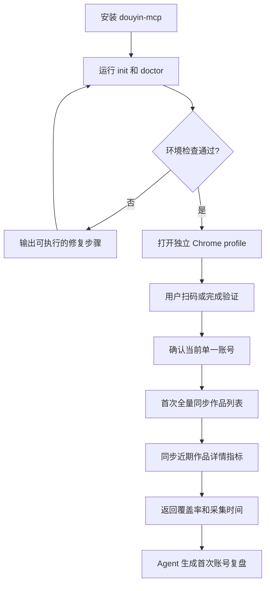
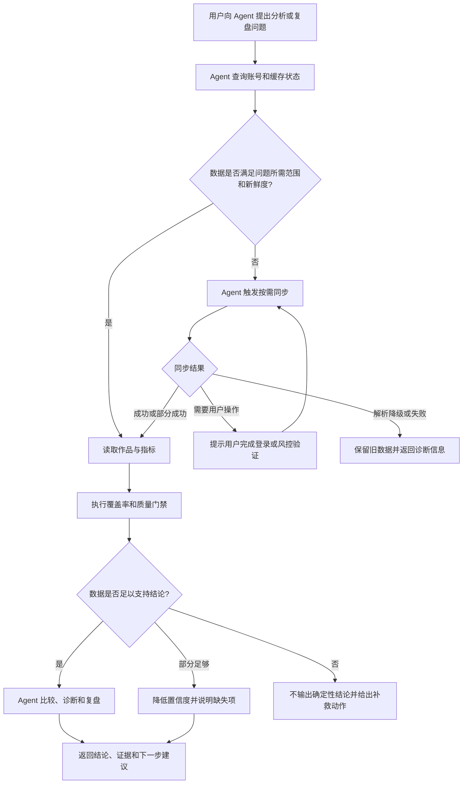

# douyin-mcp 产品需求文档（单账号 Agent 数据分析闭环）

## 1. 文档信息

| 项目 | 内容 |
|---|---|
| 文档版本 | V1.1 |
| 创建日期 | 2026-07-13 |
| 产品阶段 | 浏览器登录态 MVP -> 单账号可用产品 |
| 文档状态 | 待评审 |
| 适用项目 | douyin-mcp |

### 1.1 修订记录

| 版本 | 日期 | 修订内容 |
|---|---|---|
| V1.0 | 2026-07-13 | 建立用户可用性闭环方案 |
| V1.1 | 2026-07-13 | 收敛为单账号 MVP；将 Agent 自主取数、直接分析复盘确立为唯一核心价值链 |

## 2. 产品定义

douyin-mcp 是一个运行在用户本机的 MCP Server。它复用用户在独立 Chrome profile 中的抖音创作者中心登录态，获取用户本人可见的视频及经营数据，将数据结构化保存到本地，并向 Agent 提供同步、查询、比较和复盘工具。

它最重要的设计初衷不是再做一个数据看板，而是为 Agent 建立一条可靠的数据访问通道：

```text
传统链路：用户打开后台 -> 查找或导出数据 -> 整理数据 -> 发送给 Agent -> Agent 分析

目标链路：用户提出问题 -> Agent 自主获取最新数据 -> Agent 直接分析复盘 -> 返回结论和证据
```

V1 只服务一个用户、一个本地抖音账号和一个持久化浏览器 profile。所有 MCP 工具默认作用于这个账号，不要求 Agent 或用户传递账号 ID。

## 3. 执行摘要

当前项目已经完成浏览器登录态通道的核心技术验证：

- 用户可以通过本机 Chrome 登录抖音创作者中心。
- MCP 可以复用持久化 profile，加载作品管理列表。
- 作品和页面可见指标可以写入 SQLite。
- Agent 可以调用 MCP 查询已入库数据。
- 已使用真实账号完成页面声明数、加载数和解析数一致的全量同步验证；真实数量不进入仓库。

但当前能力仍没有完整形成用户闭环：安装和配置偏开发者化；日常同步可能打扰用户；列表页指标覆盖有限；视频详情中的留存、完播和转化指标尚未完整采集；Agent 缺少统一的数据新鲜度判断、质量门禁和直接复盘工具。

本 PRD 的目标是让用户只需完成一次登录，之后直接向 Agent 提出自然语言问题。Agent 负责判断是否需要更新数据、调用同步工具、读取所需指标、识别数据缺失，并基于真实数据完成分析和复盘。

### 3.1 北极星目标

> 在登录态有效且页面可访问的前提下，用户无需手动查数、截图、导出或复制数据，只需提出分析问题，Agent 就能自主取得足够新鲜且可解释的数据，并直接给出有证据的复盘结论。

### 3.2 核心成功标准

- 用户向 Agent 传递数据的人工步骤为 0。
- 首次安装、登录、同步和得到首份分析结果不超过 10 分钟。
- 日常分析请求中，Agent 自动完成数据新鲜度检查和必要同步。
- 所有结论可追溯到具体视频、原始指标、采集时间和计算公式。
- 页面未展示或无法确认的指标返回 `null`，不以 0 代替，不允许臆造。

## 4. 背景与问题

### 4.1 用户现状

个人抖音创作者缺少一个可供本地 Agent 稳定读取本人视频数据的接口。官方开放平台对应用主体和开放能力有约束，而人工截图、表格导出和复制粘贴无法持续更新，也会让每次复盘都重复经历相同的数据准备工作。

用户真正想完成的任务不是“把数据导出来”，而是：

- 找出近期最有潜力的视频及原因。
- 判断视频的问题发生在点击、前 5 秒、整体留存还是互动转化。
- 比较不同选题、结构或表达方式的表现。
- 总结可复用经验，并指导下一批内容。

当 Agent 无法自行获取数据时，用户必须充当数据搬运者，分析质量也受截图不完整、数据过期和口径不一致影响。

### 4.2 要解决的核心问题

1. Agent 如何在不接触账号密码和原始 Cookie 的情况下读取用户本人可见数据。
2. Agent 如何自行判断本地数据是否足够新鲜，并在需要时触发同步。
3. 第二天或更晚再次使用时，如何尽量复用登录态并降低用户感知。
4. 如何获得单条视频的 5 秒完播率、整体完播率、点赞率、收藏率、评论率、播放率和互动率等深度指标。
5. 页面指标缺失、登录失效或页面改版时，如何避免 Agent 基于错误数据得出结论。
6. 如何让 Agent 从“返回数据”进一步完成比较、诊断、潜力判断和周期复盘。

## 5. 产品范围

### 5.1 目标用户

| 用户 | 核心任务 | 当前障碍 |
|---|---|---|
| 个人抖音创作者 | 让 Agent 基于本人真实数据分析内容表现 | 每次都要人工查数并转交 Agent |
| 使用本地 Agent 的内容运营者 | 快速完成个人账号的日常和周期复盘 | 数据入口不稳定、指标口径不统一 |
| douyin-mcp 开发者 | 扩展采集和分析能力 | 页面变化、调试困难、质量状态不透明 |

### 5.2 V1 产品目标

1. 只支持一个本地抖音账号，减少配置、交互和数据隔离复杂度。
2. 新用户在 10 分钟内完成初始化、首次登录、首次同步和首次分析。
3. 登录态有效时，Agent 能在用户不参与数据搬运的情况下获取和更新视频数据。
4. Agent 自动选择缓存或同步，避免每次分析都无条件打开浏览器。
5. 支持作品列表全量同步和指定作品、近期作品的详情指标同步。
6. 建立明确的数据新鲜度、指标覆盖率、来源和缺失原因机制。
7. 提供原始指标、派生比率、视频比较、潜力排序和周期复盘能力。
8. Agent 的分析结果必须包含数据依据、结论置信度和数据限制。
9. 支持本地数据导出和经用户二次确认的数据清除。

### 5.3 非目标

- V1 不支持多账号并存、账号列表或账号切换；更换账号必须主动重置并重新登录。
- 不绕过扫码、验证码、风控或平台权限限制。
- 不调用或逆向抖音私有内部 API。
- 不自动发布、编辑、删除作品或执行点赞、评论等互动操作。
- 不向 Agent 返回 Cookie、Storage、验证码、手机号或账号密码。
- 不臆造页面未展示或无法可靠推导的指标。
- 不承诺后台同步在所有抖音风控场景下都完全无窗口运行。
- V1 不提供跨用户云端托管和跨设备登录态同步。
- V1 不负责替代 Agent 的通用推理能力；MCP 提供可靠数据、基础计算和结构化复盘上下文。

## 6. 产品原则

1. **Agent 优先**：工具设计首先服务 Agent 自主完成任务，而不是要求用户理解采集流程。
2. **数据先于分析**：先确认数据新鲜度和完整性，再允许输出确定性结论。
3. **原始指标优先**：保存页面真实展示值，派生指标必须注明公式和分母。
4. **缺失不等于零**：页面未展示、解析失败或分母缺失时统一返回 `null`。
5. **缓存优先、按需更新**：数据在有效期内直接使用，只更新分析真正需要的数据。
6. **低打扰、可见回退**：正常更新优先后台运行；需要登录或风控验证时才请求用户处理。
7. **结论可追溯**：分析必须引用具体视频、指标值、采集时间和数据覆盖率。
8. **本地优先**：浏览器登录态和业务数据保存在本机，不上传到 douyin-mcp 自有服务。
9. **只读最小权限**：MCP 默认只获取和分析数据，破坏性操作不暴露为无确认工具。

## 7. 核心用户流程

### 7.1 首次使用流程



### 7.2 日常 Agent 自主分析流程



### 7.3 目标交互示例

用户只需提出：

> 分析我最近 20 条视频，找出最有潜力的 5 条，并告诉我下一批内容应该继续什么、停止什么。

Agent 应自行完成：

1. 检查数据最近更新时间和详情指标覆盖率。
2. 在缓存不足时同步作品列表及最近 20 条详情。
3. 获取播放、留存、互动和内容价值指标。
4. 识别缺失值并执行质量门禁。
5. 对同一账号内的视频进行比较和潜力排序。
6. 输出结论、具体视频证据、置信度和可执行建议。

用户不需要打开创作者中心查数，不需要导出表格，也不需要把数据再次发送给 Agent。

## 8. 功能需求

### 8.1 初始化与诊断

#### `douyin-mcp init`

- 创建本地数据、日志、报告和浏览器 profile 目录。
- 自动生成必要的本地配置，不要求用户手工生成历史 OpenAPI 密钥。
- 检测 Chrome 路径和版本。
- 初始化或迁移 SQLite schema。
- 生成 Codex 及通用 MCP Client 配置片段。
- 明确显示下一步登录命令。

#### `douyin-mcp doctor`

- 检查 MCP Server 是否可启动。
- 检查 Chrome 和专用 profile 是否可访问。
- 检查 profile 是否被其他同步任务占用。
- 显示登录状态、最近成功同步时间、最后失败原因和解析器版本。
- 检查数据目录是否被 Git 忽略。
- 只输出可操作诊断，不泄露浏览器敏感数据。

### 8.2 单账号登录态

- 使用一个独立、持久化的 Chrome profile 保存登录态。
- 首次登录必须打开可见 Chrome，由用户本人扫码或完成平台验证。
- 首次成功列表同步时，用多条作品的标题和发布时间生成摘要，再以本地随机盐二次哈希形成轻量账号指纹；不保存昵称作为身份。
- MCP 工具不接受 `account_id`，默认操作当前唯一账号。
- 同一时刻只允许一个同步任务占用 profile。
- 更换账号必须执行显式重置流程，清理或归档旧账号数据后重新登录。
- 不读取用户日常 Chrome profile，不要求导入 Cookie。

### 8.3 Agent 数据编排

Agent 在每次数据型问题中遵循以下策略：

1. 先调用状态工具，确认登录、缓存、同步任务和数据质量。
2. 根据用户问题确定所需时间范围、视频范围和指标集合。
3. 数据在有效期内时直接查询缓存。
4. 数据过期或覆盖不足时调用 `sync_if_needed`。
5. 只有需要深度指标的视频才进入详情同步，避免无差别打开全部详情页。
6. 遇到 `user_action_required` 时向用户说明唯一需要完成的动作，验证后自动续跑。
7. 分析前读取质量信息；质量不足时降低置信度或停止推断。

默认新鲜度：

| 数据类型 | 默认有效期 | 更新策略 |
|---|---:|---|
| 登录状态 | 1 小时 | 分析前轻量检查，失败时再打开可见浏览器 |
| 作品列表及列表指标 | 24 小时 | 过期后全量或增量同步 |
| 视频详情指标 | 24 小时 | 仅同步指定或近期作品 |
| 历史快照 | 永不过期 | 只追加，不覆盖历史采集时间点 |

### 8.4 作品列表同步

- 打开抖音创作者中心作品管理页。
- 自动滚动并加载完整作品列表。
- 记录页面声明作品数、已加载数和成功解析数。
- 采集视频标识、标题、发布时间、状态、封面、可访问链接和列表页可见指标。
- 对已存在作品执行幂等更新，并追加当次指标快照。
- 无法确认稳定平台视频 ID 时，保留来源指纹和迁移能力，避免标题修改后无提示地产生重复作品。
- 全量加载未完成时不得将同步状态标记为完整成功。

### 8.5 视频详情指标同步

- 默认同步最近 20 条作品详情。
- 支持 Agent 指定一个或多个视频。
- 单次最多同步 50 条，超出时分批执行。
- 缓存仍有效的视频不重复打开详情页。
- 任务中断后可从未完成位置继续。
- 每个指标保存原始展示文本、标准化数值、来源页面和采集时间。
- 页面不存在某项指标时记录缺失原因，不写入 0。

必须优先支持的原始指标：

| 指标 | 字段 | 要求 |
|---|---|---|
| 曝光量 | `exposure_count` | 页面可见时采集，用于计算播放率 |
| 播放量 | `play_count` | 优先使用详情页，列表页作为可追溯来源 |
| 5 秒完播率 | `five_second_completion_rate` | 优先保存平台直接展示比例 |
| 整体完播率 | `completion_rate` | 优先保存平台直接展示比例 |
| 平均播放时长 | `average_watch_duration_seconds` | 统一换算为秒 |
| 点赞量 | `like_count` | 保存整数和来源 |
| 收藏量 | `collect_count` | 保存整数和来源 |
| 评论量 | `comment_count` | 保存整数和来源 |
| 分享量 | `share_count` | 保存整数和来源 |
| 涨粉量 | `follower_gain` | 页面存在时采集 |

### 8.6 派生指标

| 指标 | 字段 | 计算公式 |
|---|---|---|
| 点赞率 | `like_rate` | `like_count / play_count` |
| 收藏率 | `collect_rate` | `collect_count / play_count` |
| 评论率 | `comment_rate` | `comment_count / play_count` |
| 分享率 | `share_rate` | `share_count / play_count` |
| 播放率 | `play_rate` | `play_count / exposure_count` |
| 互动率 | `interaction_rate` | `(like_count + collect_count + comment_count + share_count) / play_count` |

统一规则：

- 分母为 0、缺失或来源不可靠时返回 `null`。
- 比率内部以 0 到 1 的小数存储，对外同时允许提供百分比格式。
- 平台直接展示的比率和本地计算比率分字段保存，不互相覆盖。
- 原始值修正后，派生指标必须可重新计算。
- 同一份分析中必须使用同一公式版本。

### 8.7 数据质量与可信度

每次同步必须返回：

```json
{
  "status": "partial",
  "declared_video_count": 62,
  "loaded_video_count": 62,
  "parsed_video_count": 62,
  "videos_with_list_metrics": 22,
  "videos_with_detail_metrics": 18,
  "list_metric_coverage": 0.355,
  "detail_metric_coverage": 0.290,
  "captured_at": "2026-07-13T10:00:00+08:00",
  "parser_version": "creator-manage-v2",
  "missing_reasons": [
    "40 条作品在列表页未展示互动指标",
    "4 条作品详情数据暂不可用"
  ]
}
```

质量规则：

- 页面声明数、加载数和解析数一致时，作品列表结构质量才可为 `complete`。
- 页面声明数大于解析数时，同步不得返回完整成功。
- 指标覆盖率按“具有有效值的视频数 / 分析范围内视频数”计算。
- 分析范围内关键指标覆盖率低于 60% 时，默认不得输出高置信度排名。
- 旧数据仍可用但本次同步失败时，应保留旧数据并标记其采集时间，不以失败结果覆盖。
- 所有工具结果包含 `freshness`、`coverage`、`captured_at` 和 `warnings`。

### 8.8 查询、比较与复盘

Agent 应能完成以下任务：

- 按发布时间、播放量、互动率、完播率或潜力分排序作品。
- 获取单条视频的原始指标、派生指标和历史趋势。
- 比较 2 至 50 条视频，并统一指标口径和采集时间窗口。
- 找出播放高但留存低、留存高但互动低、曝光高但播放率低等结构性问题。
- 在同一账号内部识别表现分位数、异常值和近期趋势。
- 生成日、周、月或自定义时间范围复盘。

复盘输出至少包含：

1. 数据范围、最近采集时间、覆盖率和质量等级。
2. 核心结论摘要。
3. 表现最佳和最弱视频及其关键证据。
4. 留存、互动、内容价值和分发效率四维诊断。
5. 可继续复用的内容模式。
6. 应停止或需要验证的内容假设。
7. 下一批选题、开头、结构或互动设计建议。
8. 数据限制、置信度和需要补采的指标。

### 8.9 数据导出与清除

- 支持导出 JSON 和 CSV，包含原始指标、派生指标、来源及采集时间。
- 支持查看本地数据目录和占用空间。
- 清除数据只能通过本地 CLI 执行，并要求用户二次确认。
- 清除范围包括 SQLite 数据、报告、日志中的业务数据和专用浏览器 profile。
- 不向 Agent 暴露可无确认删除全部数据的 MCP 工具。

## 9. MCP 工具设计

V1 工具均作用于当前唯一账号，不提供 `account_id` 参数。

| 工具 | 用途 | 关键输入 |
|---|---|---|
| `douyin_browser_get_status` | 查询登录、缓存、同步和质量状态 | 无 |
| `douyin_browser_sync_if_needed` | 根据范围和有效期决定是否同步 | `max_age_hours`、`scope`、`mode` |
| `douyin_browser_sync_creator_data` | 全量或增量同步作品列表 | `mode`、`force` |
| `douyin_browser_sync_video_details` | 同步指定或近期作品详情 | `video_ids`、`recent_limit`、`force` |
| `douyin_browser_list_videos` | 分页读取作品和最新指标 | `limit`、`offset`、`filters`、`sort` |
| `douyin_browser_get_video_performance` | 获取单条视频完整表现和趋势 | `video_id`、`period` |
| `douyin_browser_compare_videos` | 横向比较多条视频 | `video_ids`、`metrics`、`period` |
| `douyin_browser_rank_video_potential` | 在当前账号内按潜力和维度排序 | `period`、`limit`、`weights` |
| `douyin_browser_get_metric_coverage` | 查看各指标覆盖率与缺失原因 | `period`、`video_ids` |
| `douyin_browser_generate_review` | 生成结构化周期复盘上下文 | `period`、`focus`、`recent_limit` |
| `douyin_browser_export_data` | 导出本地业务数据 | `format`、`period` |

### 9.1 通用返回结构

```json
{
  "ok": true,
  "status": "completed",
  "data": {},
  "freshness": {
    "captured_at": "2026-07-13T10:00:00+08:00",
    "age_hours": 2.5,
    "is_stale": false
  },
  "coverage": {
    "videos": 20,
    "detail_metrics": 18,
    "rate": 0.9
  },
  "warnings": [],
  "next_action": null
}
```

### 9.2 工具行为要求

- 同步类工具应幂等，相同任务不得产生重复作品或重复无意义快照。
- 查询类工具默认不触发浏览器；需要更新时由 Agent 显式调用 `sync_if_needed`。
- 长任务返回任务 ID、进度和可重试状态。
- `user_action_required` 必须包含用户动作、已完成进度和恢复方式。
- 工具描述应指导 Agent 先检查状态和质量，再进行分析。
- 错误信息不得包含 Cookie、完整浏览器存储或账号敏感字段。

## 10. 数据模型

### 10.1 核心实体

| 实体 | 作用 | 关键字段 |
|---|---|---|
| `browser_account_binding` | 保存唯一账号的不可逆作品锚点 | `anchor_hashes`、`anchor_count`、`created_at`、`last_verified_at` |
| `videos` | 保存作品稳定属性 | `video_id`、`source_fingerprint`、`title`、`published_at`、`status` |
| `video_metric_snapshots` | 保存每次采集的原始指标快照 | `video_id`、各原始指标、`source`、`captured_at` |
| `video_derived_metrics` | 保存可重算的派生指标 | 各比率、`formula_version`、`calculated_at` |
| `sync_runs` | 保存同步任务和质量结果 | `scope`、`status`、数量、覆盖率、错误类型、时间 |
| `analysis_runs` | 保存复盘所用范围和证据索引 | `period`、`video_ids`、`quality_level`、`created_at` |

### 10.2 单账号约束

- `browser_account_binding` 在 V1 只能存在一条有效记录，原始标题、作品 ID 和随机盐不得通过 MCP 状态返回。
- 内部可保留固定兼容键 `browser-default`，但不作为用户或 Agent 可选择参数。
- 所有业务表默认关联当前唯一账号，V1 不建设账号切换和并存逻辑。
- 更换账号通过重置流程完成，必须防止新旧账号数据静默混合。

## 11. 分析与潜力评分

潜力评分用于帮助 Agent 组织证据，不替代 Agent 对内容语义和创作目标的判断。评分仅在当前单一账号内部进行相对比较。

### 11.1 四维评分

| 维度 | 默认权重 | 代表指标 |
|---|---:|---|
| 留存 | 35% | 5 秒完播率、整体完播率、平均播放时长 |
| 内容价值 | 30% | 收藏率、分享率、涨粉效率 |
| 互动 | 20% | 点赞率、评论率、互动率 |
| 分发效率 | 15% | 播放率、播放量的账号内分位数 |

### 11.2 计算规则

- 每项指标在同一账号、可比时间范围内进行百分位归一化。
- 缺失指标不按 0 计分，可用权重按比例重新归一化。
- 可用权重低于总权重 60% 时不输出总分，只输出已有维度。
- 每个总分返回分项得分、使用指标、缺失指标和公式版本。
- 样本少于 10 条时标记 `small_sample`，避免过度解释分位数。
- Agent 最终结论必须结合视频主题、发布时间和样本规模，不得只按总分生成建议。

## 12. 状态与异常处理

| 状态 | 含义 | Agent 后续动作 |
|---|---|---|
| `completed` | 目标范围同步并解析完成 | 进入质量门禁和分析 |
| `partial` | 部分作品或指标缺失 | 读取覆盖率，必要时补采并降低置信度 |
| `cache_hit` | 缓存仍在有效期内 | 直接查询和分析 |
| `background_success` | 后台同步成功 | 使用最新数据分析 |
| `user_action_required` | 登录或风控需要用户处理 | 提示用户完成验证后恢复任务 |
| `parser_degraded` | 页面可访问但解析器不匹配 | 使用带时间戳的旧数据，不采信错误新值 |
| `sync_in_progress` | profile 被同步任务占用 | 查询任务进度，避免重复启动 |
| `failed` | 网络、浏览器或数据库错误 | 返回分类错误和可执行恢复建议 |

关键异常要求：

- 登录失效：打开可见浏览器，用户完成验证后从原任务继续。
- 页面改版：保存脱敏诊断快照和解析器版本，不写入可疑指标。
- 网络中断：保留已完成进度并支持有限次数退避重试。
- profile 被占用：返回现有任务状态，不创建第二个 Chrome 实例争用目录。
- 数据不足：明确说明无法回答的部分，不将“没有数据”表达为“表现为零”。
- 更换账号：阻止直接同步，要求执行显式重置，避免数据混合。

## 13. 非功能需求

### 13.1 性能

- 状态查询和缓存查询 P95 小于 1 秒。
- 1000 条作品的本地分页查询 P95 小于 2 秒。
- 目标账号作品列表全量同步在正常网络下目标小于 3 分钟。
- 20 条视频详情同步目标小于 10 分钟，并持续返回进度。

### 13.2 可靠性

- 查询工具成功率不低于 99.5%。
- 登录有效且页面结构匹配时，同步任务成功或部分成功率不低于 95%。
- 相同页面输入的解析结果必须确定且可重复。
- 数据库写入使用事务，任务中断不得破坏已有快照。

### 13.3 安全与隐私

- Chrome profile、数据库和日志只保存在本机用户目录。
- 日志默认脱敏，不记录 Cookie、验证码、手机号和完整 Storage。
- MCP 返回值不包含浏览器认证材料。
- 数据导出由用户主动触发，清除操作必须二次确认。
- 文档明确说明浏览器自动化可能受平台页面和风控策略变化影响。

### 13.4 可维护性

- 页面定位、字段映射、标准化和数据库写入分层实现。
- 解析器具有版本号、固定样本测试和回归夹具。
- 数据库 schema 通过迁移管理。
- 指标公式具有独立版本，历史结果可复算和解释。

## 14. 四阶段实施路线

### 阶段一：单账号 Agent 数据入口

目标：让浏览器通道成为默认且独立的运行模式，Agent 能稳定读取当前唯一账号数据。

- 浏览器模式与历史 OpenAPI 初始化解耦。
- 移除浏览器模式对 `TOKEN_ENCRYPTION_KEY` 的要求。
- 工具层隐藏 `account_id`，统一使用当前账号。
- 完成 `init`、`doctor`、单 profile 锁和账号更换保护。
- 固化列表同步、SQLite 入库和基础查询。

验收效果：用户完成一次登录后，Agent 可以自行读取当前账号的完整作品列表和已有指标。

### 阶段二：自主同步与数据质量闭环

目标：Agent 能判断何时需要同步，并可靠说明数据是否足够用于分析。

- 实现 `get_status` 和 `sync_if_needed`。
- 建立缓存 TTL、后台优先、可见回退和任务续跑策略。
- 返回作品数量、指标覆盖率、采集时间和缺失原因。
- 增加同步任务锁、进度、错误分类和解析降级保护。

验收效果：用户直接提出数据问题时，Agent 能自动使用缓存或更新数据，无需用户手工查数。

### 阶段三：视频详情与深度指标

目标：Agent 获得判断视频潜力和内容价值所需的真实指标。

- 按需同步指定或近期视频详情。
- 采集曝光、播放、5 秒完播、整体完播、平均播放时长及互动原始值。
- 统一计算点赞率、收藏率、评论率、分享率、播放率和互动率。
- 建立快照、趋势、指标公式版本和缺失值规则。

验收效果：Agent 能区分视频在分发、前 5 秒、整体留存或互动转化中的具体问题。

### 阶段四：直接分析复盘与产品化

目标：完成从用户提问到 Agent 输出数据化复盘的端到端闭环。

- 提供比较、潜力排序、覆盖率和周期复盘工具。
- 输出四维诊断、视频证据、置信度和下一步建议。
- 完成快速开始文档、Agent 使用提示、导出和清除流程。
- 建立真实账号回归样本、解析器监控和发布验收流程。

验收效果：用户只提出分析目标，Agent 自行取数并直接完成复盘，人工数据传递步骤为 0。

## 15. 发布验收标准

| 编号 | 验收项 | 通过条件 |
|---|---|---|
| AC-01 | 单账号范围 | 所有 V1 工具无需账号参数，系统只操作当前唯一账号 |
| AC-02 | 首次可用 | 新环境在 10 分钟内完成初始化、登录、同步和首份分析 |
| AC-03 | Agent 自主取数 | 用户提出一次自然语言分析请求后，Agent 自行完成状态检查、必要同步和查询 |
| AC-04 | 零人工搬运 | 正常登录态下，用户无需截图、导出、复制或再次上传数据 |
| AC-05 | 登录态复用 | 关闭网页和浏览器后，第二天可优先后台复用 profile；失效时明确请求用户验证 |
| AC-06 | 列表完整性 | 页面声明数、加载数和解析数全部返回，不完整时不得标记完整成功 |
| AC-07 | 深度指标 | 可获取页面真实展示的 5 秒完播率、整体完播率及详情原始指标 |
| AC-08 | 派生指标 | 点赞率、收藏率、评论率、分享率、播放率和互动率公式正确且可追溯 |
| AC-09 | 缺失值 | 页面未展示或分母缺失时返回 `null` 和原因，不返回伪造的 0 |
| AC-10 | 数据新鲜度 | 每个数据结果包含采集时间、缓存年龄和是否过期 |
| AC-11 | 分析证据 | 每项主要结论至少引用一条具体视频及其关键指标 |
| AC-12 | 分析可信度 | 覆盖不足或样本过小时，Agent 明确降低置信度或拒绝确定性排名 |
| AC-13 | 异常恢复 | 登录失效、profile 占用、网络中断和页面改版均返回可执行恢复动作 |
| AC-14 | 数据安全 | MCP、日志和错误信息不泄露 Cookie、验证码或账号密码 |
| AC-15 | 更换账号保护 | 检测到账号变化时阻止混合写入，并要求显式重置 |
| AC-16 | 数据生命周期 | 用户可导出数据，并可通过 CLI 二次确认后彻底清除本地数据和 profile |

### 15.1 端到端验收用例

测试指令：

> 复盘我最近 20 条抖音视频，指出最有潜力的 5 条、表现不佳的主要原因，以及下一周应该测试的 3 个内容方向。

通过条件：

1. Agent 不要求用户先提供截图、表格或指标。
2. Agent 先检查缓存；过期时自动同步列表和必要详情。
3. 登录有效时，全流程不需要用户操作浏览器。
4. Agent 返回数据时间、视频范围、详情覆盖率和缺失指标。
5. Agent 使用留存、互动、内容价值和分发指标进行比较。
6. 每个关键判断引用具体视频和指标，不只给通用创作建议。
7. 数据不足时明确说明限制，不生成伪精确结论。

## 16. 产品指标

| 指标 | 目标 |
|---|---:|
| 人工数据传递步骤 | 0 |
| 首次价值时间 TTFV | <= 10 分钟 |
| Agent 自主数据获取成功率 | >= 90% |
| 登录有效时分析请求端到端完成率 | >= 95% |
| 日常同步需要用户可见操作的比例 | <= 10% |
| 列表解析准确率 | >= 98% |
| 已覆盖指标标准化准确率 | >= 99% |
| 主要结论证据引用率 | 100% |
| 缺失值错误写 0 的次数 | 0 |
| 新旧账号数据混合事件 | 0 |

## 17. 当前基线与差距

| 能力 | 当前状态 | V1 要求 |
|---|---|---|
| 浏览器扫码登录 | 已实现 | 保留并优化引导 |
| 持久化 profile | 已实现 | 增加状态检查、锁和更换账号保护 |
| 全量作品列表 | 已实现并通过真实账号全量一致性验证 | 增加完整性和解析版本报告 |
| SQLite 入库 | 已实现 | 增加详情快照、公式版本和迁移 |
| 列表页指标 | 部分实现，真实样本覆盖有限 | 明确覆盖率和缺失原因 |
| Agent 查询 | 已实现基础列表和快照报告 | 增加状态、比较、排序和复盘工具 |
| 浏览器模式独立启动 | 未完全实现 | 移除历史 OpenAPI 密钥依赖 |
| 后台按需同步 | 未完成 | 缓存优先、后台尝试、可见回退 |
| 视频详情深度指标 | 未完成 | 支持近期和指定视频按需同步 |
| Agent 直接分析闭环 | 未完成 | 用户只提问题，Agent 自主取数并复盘 |

## 18. 风险与应对

| 风险 | 影响 | 应对 |
|---|---|---|
| 抖音页面结构变化 | 解析失败或字段错位 | 解析器版本、固定样本回归、降级状态、旧数据保护 |
| 登录态失效或触发风控 | 后台同步中断 | 可见浏览器回退、用户验证、任务续跑 |
| 指标并非所有视频都展示 | 分析覆盖不足 | 指标级覆盖率、缺失原因、置信度门禁 |
| 详情同步耗时过长 | 用户等待和风控风险 | 缓存、按需范围、批次限制、进度和断点续跑 |
| 视频稳定 ID 不可得 | 标题修改后重复入库 | 来源指纹、候选匹配、迁移记录和人工诊断 |
| Agent 过度解读相关性 | 产生错误创作结论 | 证据引用、样本提示、置信度、事实与建议分层 |
| 用户意外登录其他账号 | 新旧数据混合 | 账号身份校验和显式重置保护 |
| 本地敏感数据泄露 | 隐私风险 | 专用目录、日志脱敏、Git 忽略、禁止返回认证材料 |

## 19. 已确认产品决策

1. V1 只支持一个账号，工具不暴露账号选择参数。
2. 浏览器登录态是产品主通道，官方 OpenAPI 通道不属于 V1 主线。
3. 产品核心价值是 Agent 自主获取数据并直接分析，不是让用户手动导出数据。
4. 播放率定义为 `播放量 / 曝光量`；无曝光量时返回 `null`。
5. 详情同步默认最近 20 条，单次最多 50 条。
6. 列表和详情指标默认缓存有效期为 24 小时。
7. 后台同步优先，但登录、验证码和风控必须由用户本人处理。
8. 潜力总分至少需要 60% 可用权重，否则只返回分项指标。
9. 数据清除只通过本地 CLI 二次确认执行。

## 20. 评审检查清单

- [ ] 产品定位明确为 Agent 的抖音数据访问和分析闭环，而非独立数据看板。
- [ ] V1 范围明确为单账号，所有工具均不要求账号参数。
- [ ] 用户无需手动查数、截图、导出或向 Agent 搬运数据。
- [ ] Agent 自主检查新鲜度、按需同步、校验质量并执行分析。
- [ ] 原始指标、派生指标、公式、来源和缺失规则完整。
- [ ] 5 秒完播率、整体完播率及各类互动率具有明确需求和验收标准。
- [ ] 分析结果包含具体视频证据、数据时间、覆盖率和置信度。
- [ ] 登录失效、风控、页面改版、并发和账号变化均有恢复策略。
- [ ] 四阶段路线与当前实现基线和待开发差距一致。
- [ ] 非功能需求、产品指标和发布验收标准可量化。
