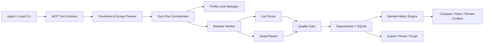

# douyin-mcp 单账号 Agent 数据分析闭环技术分析报告

## 1. 报告信息

| 项目 | 内容 |
|---|---|
| 分析对象 | `docs/user-usability-closure-plan.md` V1.1 |
| 报告版本 | V2.0 |
| 分析日期 | 2026-07-13 |
| 分析范围 | 技术架构、实现可行性、数据模型、任务协议、工程拆解、风险、测试与验收 |
| 当前技术栈 | Python 3.11+、FastMCP、Playwright、SQLite |
| 代码验证基线 | `79 passed, 6 subtests passed`；`python -m compileall -q src tests` 通过 |

## 2. 执行结论

### 2.1 总体判断

V1.1 将范围收敛为“单用户、单账号、单 profile、Agent 自主取数与分析”，相比 V1.0 显著降低了账号隔离、profile 管理和工具参数复杂度，**整体具备实施可行性，可以按四阶段路线推进**。

但完整闭环仍属于**条件可行**，不能把全部验收项视为已经过技术验证：

- 阶段一的 browser-only 解耦、CLI、单账号保护、列表同步和基础查询均属于可控工程改造，可直接实施。
- 阶段二的缓存编排、质量门禁和 profile 互斥可实现；后台无窗口复用、可见回退后续跑需要真实账号验证和持久化任务机制。
- 阶段三是关键技术闸门。当前只验证了作品列表页，尚未证明稳定详情入口、稳定视频 ID 和全部深度指标在真实页面上的可得性。
- 阶段四的比较、趋势、潜力排序和复盘可实现，但必须建立在足够的详情覆盖率、时间序列和明确评分口径之上。

建议立项结论：

| 阶段 | 结论 | 说明 |
|---|---|---|
| 阶段一：单账号 Agent 数据入口 | Go | 现有代码可复用，风险以重构和迁移为主 |
| 阶段二：自主同步与质量闭环 | Conditional Go | 先确定长任务协议，并验证 headless/profile 复用 |
| 阶段三：详情与深度指标 | Spike First | 详情入口和字段可见性验证通过后再承诺 AC-07 |
| 阶段四：直接分析复盘 | Conditional Go | 依赖阶段三数据覆盖和评分口径定稿 |

### 2.2 建议的首个可用版本

首个可用版本不应等待所有评分和复盘能力完成。建议先交付：

```text
browser-only 启动
-> init / doctor
-> 单账号身份保护与 profile 锁
-> 列表同步与历史快照
-> get_status / sync_if_needed
-> 数据新鲜度与质量门禁
-> Agent 查询已有数据
```

这个范围已经能实现“用户不再手工截图或复制列表数据”的核心价值，同时为详情指标和复盘能力提供稳定底座。

## 3. 当前代码基线

### 3.1 已具备能力

- Playwright persistent context，可使用独立 Chrome profile 保存登录态。
- 可见浏览器扫码登录、登录/验证状态识别和 profile 复用。
- 作品管理页自动滚动、作品卡片结构化解析。
- 标题、发布时间、时长、封面及页面可见播放/互动指标入库。
- `videos`、`video_metrics`、`sync_jobs`、`browser_snapshots` 和 `reports` 基础表。
- 同日重复列表同步的幂等更新。
- MCP 登录、列表同步、分页查询和基础快照报告工具。
- 真实账号全量一致性验证记录；真实作品数量不进入仓库。
- 53 个自动化测试，当前全部通过。

### 3.2 主要实现差距

| PRD 要求 | 当前实现 | 技术差距 |
|---|---|---|
| browser-only 独立启动 | `build_container()` 仍无条件构建 TokenStore、OpenAPI client、AuthService | 需要拆分运行容器和工具注册，历史 OpenAPI 改为显式启用 |
| `douyin-mcp init/doctor` | 只有 server、callback 和 smoke CLI 入口 | 缺少统一用户 CLI、环境诊断、配置生成、迁移和修复建议 |
| 工具隐藏账号参数 | browser、sync、report 等工具仍暴露 `account_id` | MCP 契约需要收敛；内部可继续使用固定兼容键 |
| 单账号身份保护 | 浏览器通道默认使用 `browser-default`，未保存可见身份 | 需要账号指纹、登录后校验和显式 reset 流程 |
| profile 互斥 | 没有跨线程/跨进程锁 | 多 Agent 或重复工具调用可能争用 persistent profile |
| 按需缓存编排 | 每次同步直接打开浏览器 | 缺少 TTL、scope、force、缓存命中和数据新鲜度服务 |
| 任务进度和续跑 | MCP 调用内同步执行，任务只记录开始/结束 | 缺少阶段、游标、心跳、进度、取消、恢复和 stale job 回收 |
| 后台优先/可见回退 | headless 是全局配置 | 需要任务级 launch mode 和状态转换 |
| 历史快照只追加 | `video_metrics` 以“视频 + 日期”作为 ID，同日更新会覆盖 | 与 V1.1 的 append-only 历史要求冲突，必须迁移 |
| 数据质量 | 仅有列表声明/加载数量的部分判断 | 缺少逐字段覆盖率、missing reason、freshness、parser version 和写入门禁 |
| 详情指标 | 未实现 | 稳定详情入口、指标可见性、解析、缓存和断点续跑均待验证 |
| 比较/趋势/评分 | 未实现 | 需要统一快照选择、公式版本、样本门禁和证据索引 |
| schema migration | 只有 `CREATE TABLE IF NOT EXISTS` | 新字段不会升级现有数据库，无法满足备份和回滚要求 |
| 导出/清除 | 未实现完整闭环 | 需要业务数据导出、二次确认、锁协调和部分失败恢复 |
| 通用响应结构 | 当前为扁平 `status` 响应 | 与 PRD 的 `ok/status/data/freshness/coverage` 契约不一致 |

## 4. 核心技术方案

### 4.1 单账号模型

V1 单账号范围是合理的。建议在 MCP 工具层完全隐藏 `account_id`，但在领域层和数据库中保留固定内部键 `browser-default`，减少现有代码和历史数据迁移成本。

账号保护不能只依赖昵称。轻量 V1 已采用作品集合锚点：首次成功全量列表同步时，将每条作品的标题与发布时间立即摘要，再使用本地随机盐二次哈希，最多保存 24 个分布式锚点。绑定表只保存加盐哈希、锚点数量和验证时间，不保存昵称、原始标题、作品 ID、Cookie 或 profile 路径，也不通过 MCP 暴露随机盐和哈希。

该方案不追求平台级强身份认证，而是解决单 profile 下最实际的“用户扫码后误切账号导致本地数据混合”问题。升级已有数据库时，只有当前页面作品与本地作品存在共同锚点才建立首次绑定；已经绑定后没有共同锚点则在写入浏览器快照和业务数据前失败。

每次浏览器同步在写业务数据前先校验身份：

```text
无本地账号 -> 建立绑定
身份一致 -> 允许同步
身份无法确认 -> account_identity_unresolved，不写业务数据
身份发生变化 -> account_mismatch，不写业务数据，要求 reset
```

账号 reset 应是本地 CLI 的显式破坏性操作。默认建议先导出或归档旧业务数据，再关闭浏览器、取得 profile 锁、清理 profile 和账号绑定。不能在检测到账号变化时自动覆盖旧账号记录。

### 4.2 browser-only 运行容器

当前 `ServiceContainer` 同时承担浏览器主线和历史 OpenAPI 依赖。建议拆分为：

```text
RuntimeContext
├── Settings
├── MigrationRunner
├── Database
├── LocalAccountRepository
└── BrowserOnlyContainer
    ├── ProfileLockManager
    ├── BrowserSessionFactory
    ├── SyncRunService
    ├── ListSyncService
    ├── DetailSyncService
    ├── FreshnessService
    ├── QualityService
    ├── AnalyticsService
    └── ReviewContextService

LegacyOpenAPIContainer（只有显式配置时才创建）
```

浏览器模式启动时不得实例化 TokenStore、OAuth、OpenAPI mapping 或 API client，也不要求 `TOKEN_ENCRYPTION_KEY`。历史工具应默认不注册，避免 Agent 看到两套相互冲突的数据通道。

不建议继续扩张当前单体 `BrowserService`。会话、同步编排、页面解析、存储、质量判断和报告生成需要分层，否则任务续跑和详情同步会快速形成难以测试的状态耦合。

### 4.3 初始化、诊断与 10 分钟 TTFV

统一增加 `douyin-mcp` CLI，建议子命令为：

```text
douyin-mcp init
douyin-mcp doctor
douyin-mcp login
douyin-mcp status
douyin-mcp data export
douyin-mcp data reset
douyin-mcp data purge
```

`init` 必须幂等，不覆盖已有有效配置。生成 MCP Client 配置时，默认输出配置片段和目标路径；如需直接修改外部客户端配置，应显式确认并保留备份。

`doctor` 应区分“只读诊断”和“在线浏览器诊断”：默认不打开浏览器；只有用户明确要求时才启动 Chrome 检查真实登录状态。输出每个检查项的结果、影响和一条可执行修复建议。

AC-02 的 10 分钟目标仍缺少环境前提。当前项目是 Python 包，如果验收机器没有 Python 3.11、包管理器或 Chrome，10 分钟无法仅靠 `init` 保证。建议验收标准明确：

- 开发者版：Python 3.11 和 Chrome 已安装。
- 普通用户版：需要另行建设带运行时的安装包，独立估算发布和签名成本。

### 4.4 同步任务与恢复协议

列表同步目标可达 3 分钟，详情同步可达 10 分钟。将整个过程绑定在单次 MCP 阻塞调用中存在客户端超时、进程中断和无法持续报告进度的问题，因此需要持久化任务状态机。

推荐状态：

```text
queued
-> running_background
-> running_visible
-> awaiting_user
-> completed | partial | parser_degraded | cancelled | failed
```

每个同步任务至少保存：

- `run_id`、`scope`、`mode`、`status`、`phase`。
- 总数、已完成数、失败数、当前视频和百分比。
- `resume_cursor`、重试次数、下次重试时间。
- profile lock owner、心跳和最后进度时间。
- 用户动作、错误分类、覆盖率、parser version。

推荐使用“单 profile、单浏览器工作队列”。BrowserSession 和 Playwright 生命周期全部归工作线程或工作进程所有，MCP 请求只创建/查询/恢复任务，避免多个调用跨线程复用同一 Playwright 对象。

登录或风控触发时：

1. 保存当前阶段和游标。
2. 将状态置为 `awaiting_user`。
3. 切换到可见浏览器并返回唯一用户动作。
4. 用户完成验证后，Agent 调用 resume 或 `sync_if_needed` 识别并恢复现有任务。
5. 从游标继续，而不是重新同步已完成详情。

PRD 工具表当前没有显式的任务查询、恢复和取消工具。建议增加：

- `douyin_browser_get_sync_run(run_id)`
- `douyin_browser_resume_sync_run(run_id)`
- `douyin_browser_cancel_sync_run(run_id)`

若坚持不增加工具，则必须明确 `get_status` 查询当前活动任务、`sync_if_needed` 自动恢复当前任务的协议，且单账号同一时刻只能存在一个未结束同步任务。

### 4.5 profile 锁和并发

profile 锁必须跨进程有效，不能只使用 Python 内存锁。建议采用：

- 操作系统文件锁负责真正互斥。
- `sync_runs` 保存 owner、PID、心跳和任务状态，用于诊断。
- SQLite 唯一约束阻止同一 profile 创建第二个 active run。
- stale lock 回收同时检查进程存活、心跳超时和浏览器占用，不仅依赖过期时间。

SQLite 建议配置 `busy_timeout`，评估 WAL 模式；写入任务、视频、指标和质量结果时使用明确事务。单账号低并发场景无需引入服务端数据库。

### 4.6 后台优先与可见回退

Playwright persistent profile 可尝试以 headless 模式执行日常同步，但真实成功率受登录状态、Chrome 行为和抖音风控影响，不能从 API 能力直接推导。

当前 headless 是全局配置，需要改为任务级 `BrowserLaunchOptions`：

- `background_first`：先 headless；需要用户时关闭 context 后以 headful 重启。
- `visible`：直接打开可见浏览器。
- `cache_only`：完全不启动浏览器。

后台转可见时必须保持同一个 `run_id` 和 `resume_cursor`，但不能同时启动两个 context 争用 profile。用户未处于可交互桌面会话时，不应强行拉起窗口，应返回 `user_action_required` 和手动恢复命令。

在阶段二开始前，至少用真实 profile 连续验证：

- 关闭浏览器后第二天 headless 复用登录态。
- headless 遇到扫码/验证时能准确识别。
- headless 关闭后 headful 能继续使用同一 profile。
- 任务异常退出后 stale lock 和游标能够恢复。

### 4.7 页面解析架构与详情 Spike

当前列表解析依赖构建后 class 名片段和页面文本，适合原型，但不足以长期支撑 98% 列表准确率与 99% 字段标准化准确率。

建议解析链路分为：

```text
Page Probe
-> Locator Strategy
-> Raw Field Extractor
-> Normalizer
-> Invariant Validator
-> Quality Gate
-> Repository
```

选择器优先级：

1. 稳定链接结构、语义属性和可访问性属性。
2. 指标标签文本与局部 DOM 关系。
3. 经过夹具验证的 class 片段回退。
4. 页面全文只用于脱敏诊断，不作为高置信结构化结果。

详情同步是完整 PRD 的最大未知项。正式实施阶段三前应安排 3～5 人日 Spike，验证：

- 列表页能否得到稳定公开视频 ID 或稳定详情链接。
- 详情页是否对目标账号展示 PRD 中的全部原始指标。
- 指标是否需要额外 tab、滚动、iframe 或异步等待。
- 新发布、低播放、审核中、隐藏或无指标作品的页面表现。
- 连续打开 20/50 个详情页是否触发限频或验证。
- 原始百分比、时长、中文单位和空值如何标准化。

Spike 至少使用 20 条真实作品，并生成脱敏 DOM 夹具、字段字典和风险结论。若目标指标只能通过未公开私有 API 获得，应按 PRD 非目标判定为不可实施，不得改走逆向接口。

### 4.8 视频详情页数据采集功能

视频详情页数据采集是 V1 核心交付能力，不只是验证项。它负责打通“用户提出单视频或近期视频分析问题 -> Agent 按需取得完播、留存和互动数据 -> 返回有证据结论”的关键链路。

#### 4.8.1 功能范围

- 默认采集最近 20 条视频详情。
- 支持指定一个或多个本地 `video_id`。
- 单次最多处理 50 条，内部按 5～10 条分批，避免长时间无反馈。
- 详情快照默认缓存 24 小时；缓存有效时不重复打开详情页。
- 只采集用户在创作者中心页面直接可见的数据，不调用或逆向私有 API。
- 登录失效时打开可见 Chrome，请用户重新扫码；登录恢复后继续未完成批次。

优先采集字段：

| 指标 | 字段 | 标准化规则 |
|---|---|---|
| 曝光量 | `exposure_count` | 中文数量单位转换为整数 |
| 播放量 | `play_count` | 保存详情页原值，列表页值保留独立来源 |
| 5 秒完播率 | `five_second_completion_rate` | 页面百分比转换为 0～1 小数，不允许推算 |
| 整体完播率 | `completion_rate` | 页面百分比转换为 0～1 小数，不允许推算 |
| 平均播放时长 | `average_watch_duration_seconds` | `mm:ss`、`hh:mm:ss` 或秒数统一转换为秒 |
| 点赞量 | `like_count` | 转换为整数并保留原始文本 |
| 收藏量 | `collect_count` | 转换为整数并保留原始文本 |
| 评论量 | `comment_count` | 转换为整数并保留原始文本 |
| 分享量 | `share_count` | 转换为整数并保留原始文本 |
| 涨粉量 | `follower_gain` | 页面存在时转换为整数，否则为 `null` |

点赞率、收藏率、评论率、分享率、播放率和互动率不从页面文本猜测，在详情原始值写入成功后由公式服务统一计算。

#### 4.8.2 采集流程

```text
确定视频范围
-> 检查 24 小时详情缓存
-> 只选择过期或缺失的视频
-> 获取视频详情入口
-> 打开详情页并确认当前视频
-> 等待指标区域稳定
-> 按标签提取原始文本
-> 标准化数值并执行质量校验
-> 事务写入详情快照
-> 返回进度、字段覆盖率和缺失原因
```

详情入口优先使用列表页公开提供的稳定视频 ID 或详情路径。若页面没有稳定 ID，可在同一浏览器会话中点击对应作品卡片进入详情，但写入前必须使用标题、发布时间、时长等可见信息确认当前详情确实属于目标视频。无法可靠确认时返回 `video_identity_unresolved`，不得把指标写入候选视频。

#### 4.8.3 页面加载与提取策略

- 页面导航完成不等于指标加载完成，应等待目标指标容器或指标标签出现。
- 如果指标位于独立 tab，使用页面可见标签进入，不依赖构建后的固定层级位置。
- 优先根据“5 秒完播率”“整体完播率”等指标标签和相邻值提取。
- class 名片段只作为回退选择器，不作为唯一定位依据。
- 对异步更新的区域，连续两次读取结构一致后再进入解析。
- 每条视频设置明确超时；超时只影响当前视频，不中断整批已完成结果。
- 每完成一条视频就更新简单进度游标，异常后从下一条未完成视频继续。

V1 不需要建设复杂任务平台。可以复用 `sync_jobs/sync_runs` 保存当前批次、已完成数量和下一视频游标，由 Agent 根据返回进度继续调用。

#### 4.8.4 可靠性门禁

详情数据写入前必须同时通过：

1. 当前页面可以确认对应目标视频。
2. 页面不是登录、验证、错误或空白页面。
3. 至少识别到一个目标指标标签，或能明确判断页面没有可用指标。
4. 百分比位于 0～1，计数为非负整数，时长为非负秒数。
5. 每个有效字段都具有原始文本、来源和采集时间。

写入策略：

- 解析成功：追加新的 `detail` 来源快照。
- 部分字段可用：写入有效字段，其余字段保存 `null` 和缺失原因。
- 页面没有展示：保存 `not_displayed`，不写 0。
- 新视频尚未产生指标：保存 `not_available_yet`。
- 页面结构不匹配：返回 `parser_degraded`，不写入可疑值。
- 当前视频无法确认：返回 `video_identity_unresolved`，不写入任何详情指标。
- 本次失败：保留上一次可信详情快照，查询时同时返回旧数据采集时间和本次失败警告。

#### 4.8.5 详情快照示例

```json
{
  "video_id": "local-video-id",
  "source": "creator_video_detail",
  "captured_at": "2026-07-13T10:00:00+08:00",
  "parser_version": "creator-detail-v2",
  "raw_metrics": {
    "five_second_completion_rate": "42.30%",
    "completion_rate": "18.60%",
    "average_watch_duration": "00:12"
  },
  "metrics": {
    "play_count": 12580,
    "five_second_completion_rate": 0.423,
    "completion_rate": 0.186,
    "average_watch_duration_seconds": 12
  },
  "missing_reasons": {
    "follower_gain": "not_displayed"
  },
  "quality": "partial"
}
```

#### 4.8.6 MCP 行为

`douyin_browser_sync_video_details` 建议输入：

- `video_ids`：指定视频，可空。
- `recent_limit`：未指定视频时同步最近 N 条，默认 20，最大 50。
- `force`：忽略 24 小时缓存，默认 `false`。

返回内容至少包括：

- 目标数量、缓存命中数量、成功数量、部分成功数量和失败数量。
- 当前批次和下一游标。
- 每个详情字段的覆盖率。
- 每条失败视频的分类原因。
- 最新详情采集时间和 parser version。
- 登录过期时唯一需要用户完成的扫码动作。

`douyin_browser_get_video_performance` 读取单条视频时，应同时返回列表原始值、详情原始值、本地派生比率、数据时间、字段来源和缺失原因，避免 Agent 把列表值与详情值混为同一口径。

#### 4.8.7 完成标准

- 最近 20 条详情可按批次采集并持续返回进度。
- 页面展示的 5 秒完播率、整体完播率和平均播放时长与人工查看结果一致。
- 不会把一条视频的详情数据写入另一条视频。
- 页面未展示的字段返回 `null` 和明确原因。
- 登录失效时能提示用户重新扫码，已完成批次不丢失。
- 单条失败不覆盖旧快照，也不阻止其他视频完成。
- 重复执行不会产生同一同步批次的重复快照。
- Agent 可以使用详情数据计算点赞率等派生指标并引用具体视频证据。

### 4.9 数据模型与迁移

必须先引入 `schema_migrations` 和版本化迁移脚本。每次结构迁移前备份 SQLite，迁移在事务中执行，并提供至少一个版本的回滚或备份恢复路径。

建议 V1 核心表：

#### `local_account`

- `id`：固定内部键 `browser-default`。
- `nickname`、`masked_identity`、`identity_fingerprint`。
- `profile_path`、`login_status`、`last_verified_at`。
- `created_at`、`updated_at`。

#### `videos`

- `id`：本地主键。
- `platform_item_id`：稳定公开 ID，可空。
- `source_fingerprint`：稳定 ID 不可得时使用。
- `title`、`published_at`、`duration_seconds`、`status`。
- `detail_url`：清除签名查询参数后保存。
- `first_seen_at`、`last_seen_at`、`is_active`、`parser_version`。

稳定 ID 不可得时，不能只用“标题 + 发布时间”直接生成最终主键。建议建立 `video_identity_aliases` 或迁移记录，在标题变化时以链接、封面、发布时间、时长等组合进行候选匹配；低置信匹配进入诊断，不静默合并。

#### `video_metric_snapshots`

- `id`、`sync_run_id`、`video_id`、`source`、`captured_at`。
- PRD 定义的所有原始数值字段。
- `raw_metric_text_json`：原始展示文本。
- `field_source_json`：每个字段来源。
- `missing_reason_json`、`quality_json`、`parser_version`。

唯一约束建议为 `(sync_run_id, video_id, source)`，保证同一任务重试不重复，同时允许不同时间的同步追加历史快照。不能继续以“视频 + 日期”作为唯一键，否则同日趋势和 append-only 要求无法同时满足。

#### `video_derived_metrics`

- 关联原始 `snapshot_id`。
- 各派生比率、`formula_version`、`calculated_at`。
- 输入原始值修正时可重算，不覆盖来源快照。

#### `sync_runs`

- 任务范围、模式、状态、阶段、游标、进度、心跳。
- 声明/加载/解析/详情成功数量。
- 字段覆盖率、缺失原因、错误分类、parser version。

#### `analysis_runs`

- 分析 period、所用视频、所用快照、质量等级、评分版本和证据索引。
- 不建议保存 Agent 的全部自然语言上下文，只保存可复现分析所需的结构化证据。

历史 `video_metrics` 数据迁移时，以 `created_at` 作为 `captured_at`，标记 `legacy_source=true`。无法恢复的原始展示文本保持 `null`，不得伪造。

### 4.10 新鲜度、覆盖率与质量状态

建议明确区分三类状态：

- 任务状态：任务是否完成、部分完成、等待用户或失败。
- 数据质量：列表结构和字段覆盖是否足够。
- 新鲜度：目标数据距离当前时间是否超过 TTL。

PRD 当前同时使用 `completed`、`background_success`、`cache_hit` 描述不同维度，容易导致 Agent 分支复杂。建议统一为：

```json
{
  "ok": true,
  "status": "completed",
  "execution": {
    "source": "browser",
    "mode": "background",
    "cache": "miss"
  },
  "quality": {
    "level": "partial"
  }
}
```

`ok` 只表示工具调用和协议执行正常；`status` 表示业务任务状态。`partial`、`cache_hit`、后台/可见模式和质量等级不要挤在同一个枚举中。

覆盖率必须按“分析范围 + 具体字段”计算。例如 20 条视频中 18 条有详情记录，并不代表 5 秒完播率也有 90% 覆盖。建议返回 `field_coverage` 映射，并使用稳定 missing reason 枚举：

- `not_displayed`
- `not_available_yet`
- `not_applicable`
- `navigation_failed`
- `parse_failed`
- `account_or_permission_limit`
- `cancelled`

查询工具默认不启动浏览器。`get_status` 返回缓存的登录验证时间和新鲜度；只有 `sync_if_needed` 判断需要更新时才进行真实页面访问。

### 4.11 派生指标、趋势与潜力评分

派生比率可以可靠实现，但所有分子、分母必须来自同一快照或明确的同一采集窗口，禁止跨时间拼接。平台直接展示比率和本地计算比率必须分字段保存。

潜力评分仍需在实现前补齐以下口径：

- 四个维度内部每个指标的具体权重。
- `涨粉效率` 的公式及分母。
- 平均播放时长如何消除视频自身时长差异；建议优先使用平均观看时长占视频时长比例。
- 互动维度是否使用聚合 `interaction_rate`。若同时加入点赞率、评论率和互动率，会重复计权。
- “可比时间范围”按发布时间、视频年龄还是采集时间定义。
- 新旧视频的播放量如何做视频年龄校正。
- 百分位遇到同值、零方差和恰好 10 条样本时的规则。
- 评分版本升级后历史分析是否重算。

样本少于 10 条标记 `small_sample`、可用权重低于 60% 不输出总分的规则合理。建议评分按请求计算并缓存，保存输入快照、版本和证据，不把分数作为脱离数据来源的最终事实。

趋势查询应明确两个时间维度：

- `published_at`：筛选哪些视频属于分析周期。
- `captured_at`：指标在什么时候被采集。

周期复盘默认应先按发布时间选视频，再为每个视频选择分析截止时间之前最新且质量合格的快照。增长趋势则使用多个 `captured_at` 快照，不能用不同视频的不同年龄直接比较绝对增长。

### 4.12 Agent 分析边界

PRD 已明确 MCP 不替代 Agent 的通用推理，这是正确边界。建议：

- MCP 负责确定性的数据读取、标准化、公式、排序、异常标记和证据打包。
- `generate_review` 返回结构化复盘上下文和规则型发现，不在服务端生成不可追溯的创作结论。
- Agent 负责结合视频主题、用户目标和上下文生成最终自然语言建议。
- 每条主要结论携带 `evidence_refs`，指向视频、快照、字段、公式版本和采集时间。

这样既能保证结论可审计，也避免在 MCP 内部建设第二套通用推理系统。

### 4.13 导出、清除与隐私

导出文件只包含业务数据、来源和公式，不包含 profile、Cookie、Storage、日志凭证或签名 URL。MCP 导出工具建议只生成本地文件并返回路径和摘要，不把大量业务数据直接塞入工具响应。

仓库侧应默认忽略 `.env`、`data/`、浏览器 profile、SQLite 及备份、浏览器登录状态/诊断产物和真实账号逐值验收报告。真实联调只在本地报告中保存作品 ID、数量和指标，进入仓库的测试必须使用合成样本。需要明确区分“认证材料不进入 Agent”和“业务数据按用户请求进入 Agent”：连接云端 Agent 时，作品标题与查询结果仍受相应模型服务的数据政策约束。

清除流程顺序：

```text
展示删除范围和占用空间
-> 用户输入明确确认
-> 停止/取消活动任务
-> 获取 profile 锁
-> 关闭浏览器
-> 备份或按选择导出
-> 事务删除数据库业务记录
-> 删除报告、诊断和 profile
-> 输出逐项结果
```

文件删除失败时应保留 `purge_partial` 状态和重试指引，不能报告彻底成功。历史业务指标可以按 PRD 永久保留，但脱敏诊断快照和日志应设置独立保留期，避免无上限增长和不必要的页面内容留存。

## 5. 推荐目标架构



推荐代码模块：

```text
src/douyin_creator_mcp/
  cli/
    app.py
    init_command.py
    doctor_command.py
    data_commands.py
  runtime/
    browser_container.py
    legacy_openapi_container.py
  browser/
    session_factory.py
    worker.py
    probes.py
    list_parser.py
    detail_parser.py
    diagnostics.py
  jobs/
    models.py
    orchestrator.py
    profile_lock.py
  storage/
    migrations/
    account_repository.py
    video_repository.py
    metric_repository.py
    sync_run_repository.py
  analytics/
    freshness.py
    quality.py
    formulas.py
    scoring.py
    comparisons.py
  reviews/
    context_service.py
```

无需一次性完成目录重构。阶段一先抽出 runtime、migration、account、lock 和 list sync；阶段三再引入 detail 和 analytics，避免只为目录整洁做大规模搬迁。

## 6. MCP 契约建议

### 6.1 工具集

PRD 现有核心工具基本合理，建议补充长任务工具：

| 工具 | 处理建议 |
|---|---|
| `douyin_browser_get_status` | 返回缓存状态、活动任务、数据新鲜度、覆盖率；默认不启动浏览器 |
| `douyin_browser_sync_if_needed` | 根据问题范围与 TTL 规划列表/详情同步，并优先恢复已有任务 |
| `douyin_browser_sync_creator_data` | 创建或恢复列表同步任务，不接受账号参数 |
| `douyin_browser_sync_video_details` | 完成详情页真实指标采集；默认最近 20 条、最多 50 条，支持指定视频、24 小时缓存、分批进度和断点 |
| `douyin_browser_get_sync_run` | 建议新增，查询进度、错误、下一步和覆盖率 |
| `douyin_browser_resume_sync_run` | 建议新增，用户验证后恢复任务 |
| `douyin_browser_cancel_sync_run` | 建议新增，协作式取消并释放锁 |
| 查询/比较/评分/复盘工具 | 只读取缓存，不隐式启动浏览器 |
| `douyin_browser_export_data` | 生成本地文件，返回路径、行数、范围和校验摘要 |

### 6.2 统一返回结构

建议在 PRD 通用结构上增加任务、质量和错误对象：

```json
{
  "ok": true,
  "status": "partial",
  "data": {},
  "run": {
    "run_id": "...",
    "phase": "detail_sync",
    "completed": 12,
    "total": 20,
    "can_resume": true
  },
  "freshness": {
    "captured_at": "2026-07-13T10:00:00+08:00",
    "age_hours": 2.5,
    "is_stale": false
  },
  "coverage": {
    "videos": 20,
    "field_coverage": {
      "completion_rate": 0.9
    }
  },
  "quality": {
    "level": "partial",
    "parser_version": "creator-detail-v2"
  },
  "warnings": [],
  "next_action": null,
  "error": null
}
```

`user_action_required` 应包含一个明确动作、可见浏览器状态、保留进度和恢复命令。错误响应保持同一结构，不让 Agent 通过完全不同的 JSON 形态判断失败。

## 7. 四阶段实施拆解

以下估算以 1 名熟悉 Python、Playwright 和 SQLite 的工程师为基准，不包含等待平台状态、账号验证和独立安装包签名时间。

### 阶段前置：技术 Spike

估算：3～5 人日。

- 验证 stable ID/详情链接。
- 验证 10 个目标原始指标的真实页面可见性。
- 验证连续 20/50 条详情访问和限频。
- 验证 headless -> headful profile 切换。
- 产出脱敏夹具、字段字典和 Go/No-Go 结论。

### 阶段一：单账号 Agent 数据入口

估算：8～13 人日。

- browser-only 容器和工具注册。
- 统一 CLI、init、doctor。
- schema migration 和旧数据迁移。
- `local_account`、身份校验和 reset 保护。
- 跨进程 profile 锁。
- MCP 工具隐藏 `account_id`。
- 列表解析分层、parser version、事务和基础查询。

完成门禁：AC-01、AC-02、AC-06、AC-14、AC-15 的基础部分通过。

### 阶段二：自主同步与质量闭环

估算：10～16 人日。

- freshness/TTL 与 scope planner。
- `get_status`、`sync_if_needed`。
- 持久化任务状态机、进度、游标、取消和恢复。
- background-first、visible fallback。
- 字段级覆盖率、missing reason、质量门禁。
- parser degraded、网络重试、旧数据保护。

完成门禁：AC-03、AC-04、AC-05、AC-10、AC-13 通过。

### 阶段三：视频详情与深度指标

估算：10～18 人日，前提是 Spike 通过。

- 从列表页获得详情入口，并在进入详情后校验目标视频。
- 完成最近 20 条或指定视频的详情页采集功能，单次最多 50 条。
- 详情 parser、5～10 条分批、24 小时缓存和简单进度游标。
- 采集曝光量、播放量、5 秒完播率、整体完播率、平均播放时长及互动原始值。
- 保存原始展示文本、标准化值、字段来源和缺失原因。
- 登录过期时打开可见 Chrome 重新扫码，保留已完成批次。
- append-only 指标快照。
- 派生公式和公式版本。
- 单视频趋势和快照选择策略。

完成门禁：AC-07、AC-08、AC-09 通过，详情指标标准化准确率有真实样本证据。

### 阶段四：直接分析复盘与产品化

估算：10～16 人日。

- 列表过滤/排序和单视频表现。
- 多视频比较、潜力排序和覆盖率工具。
- review context、证据引用和 `analysis_runs`。
- JSON/CSV 导出、reset/purge。
- 快速开始、Agent 工具提示和真实账号回归流程。

完成门禁：AC-11、AC-12、AC-16 和端到端验收用例通过。

### 总体估算

完整 V1 约 **41～68 人日**，单人顺序实施约 8～14 周。两人可以并行数据层/工具层与浏览器 parser，但详情 Spike、迁移方案和最终端到端验证仍有串行依赖。

如需面向完全不具备 Python 环境的普通用户提供 Windows/macOS 独立安装包，建议额外预留 10～20 人日。

## 8. 测试与验收准备

### 8.1 自动化测试

- 容器测试：无 OpenAPI 密钥时 browser-only 可启动，历史工具默认不注册。
- CLI 测试：init 幂等、doctor 诊断、配置备份、reset/purge 二次确认。
- 迁移测试：空库、现有 0.1.0 库、迁移失败回滚、备份恢复。
- 锁测试：同进程、跨进程、崩溃、stale lock、安全回收。
- 状态机测试：正常完成、partial、awaiting user、resume、cancel、网络重试。
- 解析契约测试：每个 parser version 对应固定脱敏夹具。
- 质量测试：声明/加载/解析不一致、字段缺失、旧数据回退、解析降级。
- 公式测试：null、0 分母、边界值、百分比、时长单位、公式版本。
- 评分测试：样本小于 10、低于 60% 权重、同值、零方差、缺失权重。
- 安全测试：MCP、错误、日志、导出和诊断不包含凭证或签名 URL。

### 8.2 真实浏览器测试矩阵

至少覆盖：

- 首次登录、登录有效、登录过期、扫码、验证码/风控。
- headless 成功、headless 失败转 visible、用户验证后续跑。
- profile 被其他 Chrome 或 MCP 进程占用。
- 10、62、100+ 作品规模。
- 最近 20 条、指定视频、50 条上限、任务中断恢复。
- 新发布、低播放、无部分指标、审核中或不可访问作品。
- 页面结构轻微变化与选择器全部失效。
- 用户误登录其他账号和显式 reset。

### 8.3 指标验收方法

PRD 的 98%/99% 准确率需要定义人工真值样本，否则无法重复验收。建议：

- 建立不少于 100 条作品卡片和 50 条详情指标的脱敏标注集。
- 对视频识别、字段识别、数值标准化分别统计准确率。
- “页面未展示”正确返回 null 也计为正确，不只统计有值样本。
- 每次 parser 发布运行固定夹具回归，并执行小规模真实账号抽检。
- 记录 P50/P95 耗时、缓存命中、网络环境和机器配置。

产品指标中的“日常可见操作比例”和“自主获取成功率”若不建设遥测，只能通过内部回归样本统计。若未来增加遥测，必须默认关闭或显式授权，且不得上传账号业务数据和浏览器身份材料。

## 9. 主要风险

| 风险 | 等级 | 应对 |
|---|---|---|
| 详情页不展示目标指标 | 高 | Spike 先行；不可见时返回 null，不转向私有 API |
| 无稳定视频 ID 或详情链接 | 高 | 来源指纹、alias/migration、低置信人工诊断；必要时限制详情能力 |
| headless 触发风控 | 高 | 后台优先但不承诺；可见回退、限速、批次和用户恢复 |
| class 哈希和页面结构变化 | 高 | 多级 locator、parser version、固定夹具、质量门禁和旧数据保护 |
| 长任务超时或进程退出 | 中高 | 持久化任务、游标、查询/恢复/取消工具、幂等写入 |
| profile 并发争用 | 中高 | OS 文件锁、唯一 active run、心跳和 stale lock 回收 |
| schema 迁移损坏用户数据 | 中高 | 自动备份、事务迁移、恢复测试、legacy 标记 |
| 同日快照覆盖导致趋势丢失 | 中高 | 改用 sync_run 级 append-only 快照和明确唯一键 |
| 评分重复计权或样本不可比 | 中 | 指标内权重定稿、年龄校正、small sample 和证据输出 |
| 账号变化导致数据混合 | 中高 | 写入前身份校验、account_mismatch、CLI reset |
| 本地敏感数据泄露 | 中高 | 专用目录、脱敏、最小留存、导出过滤和隐私测试 |

## 10. 实施前需确认的 PRD 条目

以下问题不阻塞阶段一开始，但应在对应阶段编码前定稿：

1. AC-02 的操作系统、Python 和 Chrome 环境前提。
2. 长任务采用新增 get/resume/cancel 工具，还是由 `get_status + sync_if_needed` 隐式恢复。
3. `ok`、任务状态、缓存命中、执行模式和质量等级的统一语义。
4. 账号 reset 默认“归档后重置”还是“彻底清除后重置”。
5. 详情 Spike 的真实样本数量和 AC-07 的 Go/No-Go 标准。
6. 四维评分内部指标权重、涨粉效率公式和互动率重复计权处理。
7. 周期比较的发布时间窗口、视频年龄和采集截止时间规则。
8. 诊断快照、日志和 analysis run 的保留期限。
9. 98%/99% 准确率的真值样本与统计方法。

## 11. 最终建议

更新后的单账号 PRD 已具备进入工程准备阶段的条件。推荐实施顺序为：

```text
详情/headless 技术 Spike
-> browser-only 容器与 schema migration
-> 单账号身份保护、CLI 和 profile 锁
-> append-only 列表快照与基础查询
-> freshness / sync_if_needed / 质量门禁
-> 持久化任务、后台优先、可见回退与续跑
-> 详情指标和派生公式
-> 比较、评分、证据化复盘
-> 导出、清除、真实账号回归和发布
```

实现时应坚持三个门禁：

1. 页面没有稳定展示的数据不进入确定性分析。
2. 同步质量和新鲜度不足时不输出伪精确排名。
3. 任务恢复、数据库迁移和账号身份校验完成前，不扩大自动化范围。

按该路线推进，阶段一和阶段二可以形成可靠的单账号 Agent 数据入口；完整 V1 能否达到 PRD 所述深度分析效果，最终取决于详情页 Spike 的字段覆盖结果和后台模式真实成功率。
